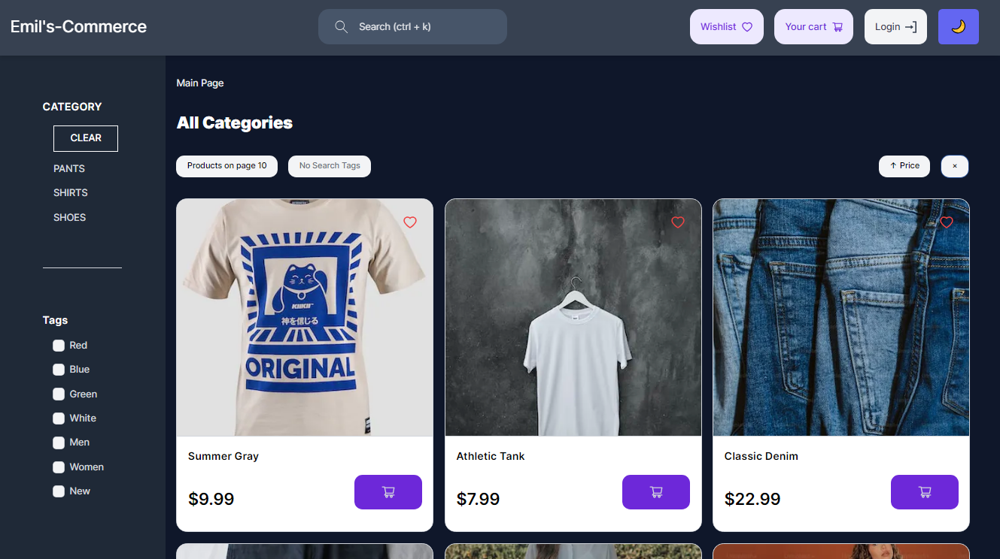
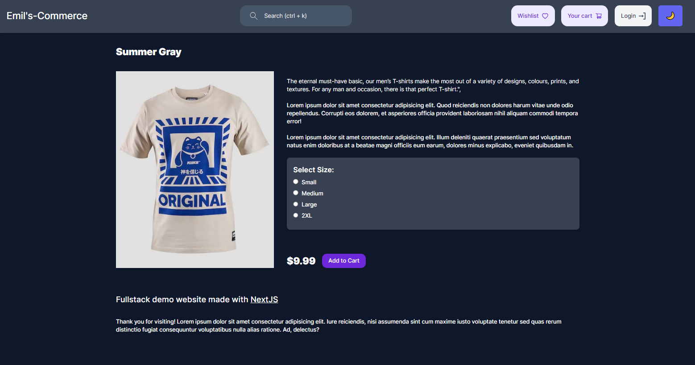

# Ecommerce app

Full-stack e-commerce app built with Next.js.



## Features:

- User Login and new Account creation with credentials
- Search bar filtering
- Tags Filtering
- Categories Filtering
- Wishlist page
- Cart page with checkout
- Dark and light color modes
- Ability to add/remove and list items when logged in by manually navigating to `baseurl/admin`

## To run locally:

1. Create a .env file and insert the following: 

```shell
DATABASE_URL=''
NEXTAUTH_SECRET=""
JWT_SECRET=''
```

2. Install dependencies with `npm i`

3. Push the database to your DB host (e.g., Railway) using Prisma

4. Run the development server: `npm run dev`
